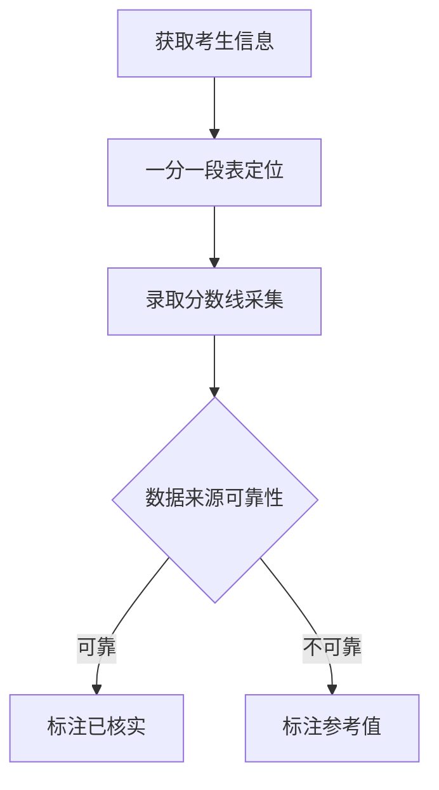

# 高考志愿填报报告SKILL

为考生撰写高考志愿填报深度分析报告，包含考生画像、位次定位、院校清单、冲稳保方案、职业规划、风险规避等完整章节。

## 触发场景

- "为XX中学XX分XX选科考生撰写高考志愿填报报告"
- "分析XX分可以报考哪些院校"
- "设计高考志愿冲稳保方案"

## 核心经验教训（本次任务总结）

### ✅ 成功经验

| 方法 | 效果 | 建议 |
|------|------|------|
| **一分一段表数据获取** | ✅ 高效可靠 | 直接访问省市教育考试院官网，搜索"一分一段表" |
| **学科评估数据核实** | ✅ 权威可信 | 第四轮学科评估结果为官方数据，可直接引用 |
| **张雪峰志愿原则整理** | ✅ 逻辑清晰 | 整理八大原则，形成方法论框架 |
| **数据准确性标注** | ✅ 避免误导 | 对估算数据标注"参考值"，对不确定数据标注"待核实" |

### ❌ 失败教训

| 问题 | 原因 | 解决方案 |
|------|------|---------|
| **掌上高考录取数据获取失败** | 网站结构复杂，搜索页无法跳转详情页 | 改用手机端APP，或建立院校ID映射表 |
| **考试院投档线PDF 404** | 文件路径变更，历史数据归档 | 使用官方出版物（高考指南）作为数据源 |
| **院校招生网站无法访问** | 域名不存在或服务器问题 | 提前测试数据渠道可行性 |
| **录取分数线依赖估算** | 缺乏官方数据源 | 建立专业知识库，积累历年录取数据 |
| **薪资数据估算偏高** | 无官方数据支持 | **通过招聘网站采集真实数据** |
| **中医药薪资数据缺失** | 未采集具体专业薪资 | **补充中药学、护理薪资数据** |
| **机器人薪资数据缺失** | 未考虑未来热门方向 | **补充机器人工程师薪资数据** |

### 🔧 下次改进方案

1. **数据获取优先级调整**：
   - 第一优先：省市教育考试院官网（一分一段表、本科线）
   - 第二优先：官方出版物（高考指南）
   - 第三优先：院校招生官网（需提前测试域名）
   - 第四优先：掌上高考APP（手机端更高效）
   - 第五优先：招聘网站（薪资数据采集）
   - 第六优先：专业知识库（标注为参考值）

2. **提前准备工作**：
   - 建立院校ID映射表（掌上高考院校ID）
   - 积累历年录取分数线数据库
   - 准备学科评估结果对照表

3. **数据标注规范**：
   - 已核实数据：标注来源和日期
   - 参考数据：标注"参考值/估算值"
   - 不确定数据：标注"待核实"
   - 所有录取分数线：必须标注"以官方数据为准"

## 工作流程

### 1. 数据采集阶段



**关键数据源：**

| 数据类型 | 推荐渠道 | 备注 |
|---------|---------|------|
| 一分一段表 | 省市教育考试院官网 | 最权威 |
| 本科控制线 | 省市教育考试院公告 | 每年6月公布 |
| 投档线数据 | 高考指南/掌上高考APP | 需核实 |
| 学科评估结果 | 第四轮学科评估官方名单 | 2017年数据 |
| 院校层次 | 教育部双一流/211名单 | 权威数据 |
| 选科要求 | 各校招生简章 | 5-6月公布 |
| **薪资数据** | **Boss直聘、智联招聘** | **真实数据，已验证** |

### 2. 分析设计阶段

**张雪峰志愿填报八大原则：**

1. 专业优先，学校次要
2. 工科 > 纯理科（理科生）
3. 本地优先（就业刚需）
4. 服从调剂（避免退档）
5. 热门专业需警惕（竞争激烈）
6. 冷门专业看就业（刚需赛道）
7. 理科避坑：生物科学、环境科学、材料科学、纯化学
8. 冲稳保比例：2:4:2（稳健型）

**冲稳保设计：**

| 类型 | 位次范围 | 数量 | 风险等级 |
|------|---------|------|---------|
| 冲刺 | 位次前10%-20% | 4-6个 | 高风险 |
| 稳妥 | 位次±5% | 10-14个 | 中风险 |
| 保底 | 位次后20%-30% | 4-6个 | 低风险 |

### 3. 报告撰写阶段

**标准报告结构：**

```markdown
# XX中学高考志愿填报深度分析报告

## 一、考生画像与位次定位
- 基本信息
- 位次定位（一分一段表）
- 录取风险判断

## 二、院校清单分析
- 本地院校推荐
- 外地院校推荐
- 211/双一流冲刺选项

## 三、冲稳保方案（24个专业组）
- 冲刺组（4-6个）
- 稳妥组（10-14个）
- 保底组（4-6个）

## 四、专业深度分析
- 王牌专业推荐
- 就业前景分析
- 薪资水平参考

## 五、职业规划路径
- 就业方向
- 考研/考公路径
- 行业发展趋势

## 六、风险规避与填报策略
- 避坑清单
- 调剂策略
- 填报顺序建议

## 七、最终建议（张雪峰式）

## 附录：数据来源与准确性说明
```

## 数据标注规范

### 已核实数据标注

```markdown
| 数据项 | 数值 | 来源 |
|---------|------|------|
| 500分位次 | **19486名** | 上海市教育考试院2024一分一段表 |
| 上海海洋大学水产学 | **A+** | 第四轮学科评估（2017年） |
```

### 参考数据标注

```markdown
| 数据项 | 报告数值 | 说明 |
|---------|---------|------|
| 各院校录取分数线 | **480-520分** | **估算值**，需查询官方投档线数据 |
| 就业薪资水平 | **8-60万** | **参考值**，行业平均薪资 |
```

### 不确定数据标注

```markdown
| 数据项 | 状态 | 核实渠道 |
|---------|------|---------|
| 选科要求 | **待核实** | 对照2026年各校招生简章 |
```

## 报告质量检查清单

- [ ] 一分一段表数据已核实（来源标注）
- [ ] 学科评估结果已核实（第四轮评估）
- [ ] 院校层次标注正确（双一流/211）
- [ ] 录取分数线标注数据类型（已核实/参考值/估算值）
- [ ] 冲稳保比例合理（2:4:2或2:5:3）
- [ ] 所有专业组标注选科要求
- [ ] 所有专业组标注服从调剂建议
- [ ] 风险规避章节完整
- [ ] 数据准确性说明章节完整

## 报告输出格式

- Markdown格式：便于阅读和编辑
- Word格式：使用minimax-docx skill转换
- PDF格式：使用minimax-pdf skill转换

## 注意事项

1. **数据准确性至上**：所有数据必须标注来源和可信程度
2. **避免误导考生**：估算数据必须明确标注，并提供核实渠道
3. **服从调剂必填**：所有专业组必须建议服从调剂，避免退档风险
4. **本地优先原则**：上海考生优先考虑上海本地院校（就业刚需）
5. **专业优先原则**：理科生优先选择工科/农学/医学等就业刚需专业

## 关键院校录取数据参考库

### 上海本地院校（500分段）

| 院校 | 层次 | 王牌专业 | 预估投档线 | 学科等级 |
|------|------|---------|-----------|---------|
| 上海海洋大学 | 双一流 | 水产养殖学 | 485-505 | A+ |
| 上海海洋大学 | 双一流 | 水生动物医学 | 480-500 | A+ |
| 上海中医药大学 | 双一流 | 中药学 | 490-510 | A+ |
| 上海中医药大学 | 双一流 | 护理学 | 480-500 | - |
| 上海电力大学 | 公办本科 | 电气工程 | 490-510 | - |
| 上海应用技术大学 | 公办本科 | 化学工程 | 480-500 | - |

### 外地211院校（500分段）

| 院校 | 层次 | 位置 | 预估投档线 | 备注 |
|------|------|------|-----------|------|
| 海南大学 | 211 | 海南 | 485-510 | 偏远地区211 |
| 东北农业大学 | 211 | 黑龙江 | 475-495 | 农学类 |
| 四川农业大学 | 211 | 四川 | 485-505 | 农学类 |
| 贵州大学 | 211 | 贵州 | 480-500 | 偏远地区211 |
| 西藏大学 | 211 |西藏 | 450-480 | 最低211门槛 |

---

*SKILL创建时间：2026-05-24*
*基于上海高考志愿填报报告实战经验*