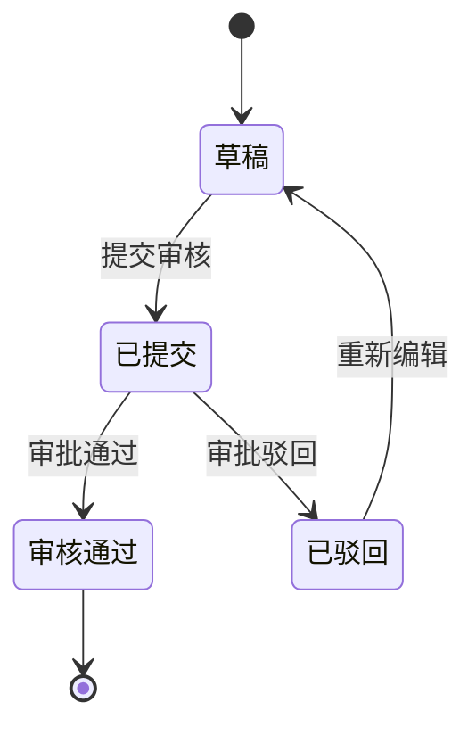

# HZERO 微服务模块设计模板

每个业务模块的详细设计按此模板输出。

## 模块名称

### 模块概述

| 项目 | 说明 |
|------|------|
| 模块名称 |  |
| 所属服务 |  |
| 功能简述 |  |
| 依赖服务 |  |

### 数据模型

#### 核心表

| 表名 | 说明 | 主键策略 |
|------|------|----------|
|  |  |  |

#### 字段定义

```sql
CREATE TABLE `table_name` (
  `id` bigint(20) NOT NULL AUTO_INCREMENT COMMENT '表ID',
  `tenant_id` bigint(20) DEFAULT NULL COMMENT '租户ID',
  `field_name` varchar(240) NOT NULL COMMENT '字段说明',
  `object_version_number` bigint(20) DEFAULT NULL COMMENT '乐观锁版本号',
  `creation_date` datetime DEFAULT NULL COMMENT '创建时间',
  `created_by` bigint(20) DEFAULT NULL COMMENT '创建人',
  `last_update_date` datetime DEFAULT NULL COMMENT '最后修改时间',
  `last_updated_by` bigint(20) DEFAULT NULL COMMENT '最后修改人',
  PRIMARY KEY (`id`) USING BTREE
) ENGINE=InnoDB DEFAULT CHARSET=utf8mb4 COMMENT='表注释';
```

**HZERO 标准字段（每个表必带）：**
- `tenant_id` — 租户 ID（除平台级表）
- `object_version_number` — 乐观锁
- `creation_date` / `created_by`
- `last_update_date` / `last_updated_by`

### API 接口设计

#### 查询接口

```
GET /v1/{organizationId}/orders
```

| 参数 | 类型 | 必填 | 说明 |
|------|------|------|------|
| page | int | N | 页码 |
| size | int | N | 每页条数 |
| status | String | N | 状态过滤 |

返回值：Page<OrderHeaderVO>

#### 新增接口

```
POST /v1/{organizationId}/orders
```

请求体：OrderHeaderDTO
返回值：OrderHeaderVO

#### 修改接口

```
PUT /v1/{organizationId}/orders
```

#### 删除接口

```
DELETE /v1/{organizationId}/orders
```

### 业务流程



### 关键业务逻辑

1. **状态校验** — 只有"草稿"状态的单据才能修改
2. **金额计算** — 新增/修改/删除明细行时，自动重算总金额
3. **唯一性校验** — 订单编号自动生成或检查唯一性

### 前端页面

| 页面 | 路由 | 功能 |
|------|------|------|
| 列表页 | `/hsord/orders` | 分页查询、筛选 |
| 编辑页 | `/hsord/orders/edit/:id` | 新增/编辑订单 |
| 详情页 | `/hsord/orders/detail/:id` | 只读查看 |

### 权限配置

| 权限编码 | 说明 | 类型 |
|----------|------|------|
| hzero-order.orders.query | 订单查询 | API |
| hzero-order.orders.create | 订单新增 | API |
| hzero-order.orders.edit | 订单编辑 | API |
| hzero-order.orders.delete | 订单删除 | API |
